# Tekton piplines for Cloud Pak for Integration

Tekton pipelines are now available to execute the following tasks in **Red Hat OpenShift Cluster Version 4.3**

* [Install all the integration instances](#31-pipeline-for-installing-all-the-integration-instances)
* [Install a specific integration instance (MQ, API Connect, Aspera, ACE, DataPower, EventStreams, Tracing, Asset Repository)](#32-pipeline-for-install-a-specific-integration-instance-mq-api-connect-aspera-ace-datapower-eventstreams-tracing-asset-repository)
* [Uninstall ALL the integration instances](#33-pipeline-for-uninstalling-all-the-integration-instances)
* [Uninstall a specific integration instance (MQ, API Connect, Aspera, ACE, DataPower, EventStreams, Tracing, Asset Repository)](#34-pipeline-for-uninstalling-a-specific-integration-instance-mq-api-connect-aspera-ace-datapower-eventstreams-tracing-asset-repository)

<p>&nbsp;</p>

### 1. Pre-requisites


#### 1.1 Install OpenShift Pipelines Operator that uses Tekton.

Login to the OpenShift Cluster and using the Operator Hub, install the **OpenShift Pipelines Operator**.

 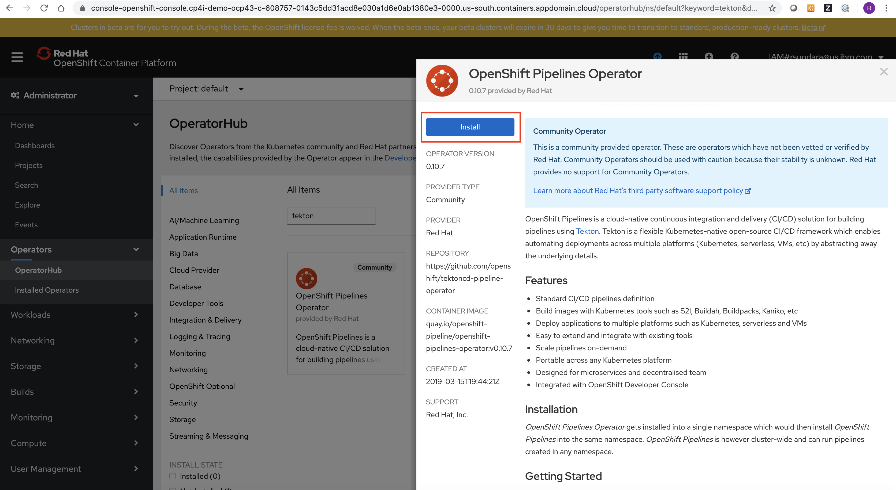
 
<p>&nbsp;</p>
 
#### 1.2 Install Tekton dashboard

The link [https://github.com/tektoncd/dashboard](https://github.com/tektoncd/dashboard) can used as reference to install Tekton dashboard. It includes the section for installing Tekton dashboard on OpenShift. The related commands are as follows:

```
oc new-project tekton-pipelines
kubectl apply --filename https://github.com/tektoncd/dashboard/releases/download/v0.5.3/openshift-tekton-dashboard-release.yaml --validate=false
```

The tekton dashboard is accessed using the following route: 

```
kubectl get route tekton-dashboard -n tekton-pipelines
```

<p>&nbsp;</p>
 

### 2. Create Tekton resources

The script [createTektonResources.sh](./createTektonResources.sh) can be run to create the resources defined in the following manifests file. Also, the script [deleteTektonResources.sh](./deleteTektonResources.sh) can be run to delete the Tekton resources.

* [cp4i-setup-secrets.yaml](./manifests/cp4i-setup-secrets.yaml)
* [cp4i-setup-resource.yaml](./manifests/cp4i-setup-resource.yaml)
* [install-integration-instance-task.yaml](./manifests/install-integration-instance-task.yaml)
* [uninstall-integration-instance-task.yaml](./manifests/uninstall-integration-instance-task.yaml)
* [cp4i-setup-pipeline.yaml](./manifests/cp4i-setup-pipeline.yaml)

Note that the scripts are designed to create the Tekton resources in the project **cp4i-setup**

The contents of the manifest file [cp4i-setup-secrets.yaml](./manifests/cp4i-setup-secrets.yaml) needs to be updated to suit the environment.

```
apiVersion: v1
kind: Secret
metadata:
  name: common-services
data:
  username: BASE64_ENCODE(COMMON_SERVICES_USER_ID)
  password: BASE64_ENCODE(COMMON_SERVICES_USER_PASSWORD)
  url: BASE64("icp-console.OCP_DOMAIN")
  cloudType: BASE64_ENCODE("ibmcloud" or "onprem")
---
apiVersion: v1
data:
  password: BASE64_ENCODE(API_KEY)
  username: BASE64_ENCODE(GIT_USER_NAME)
kind: Secret
metadata:
  annotations:
    tekton.dev/git-0: https://github.ibm.com
  labels:
    serviceAccount: pipeline
  name: git-secret
type: kubernetes.io/basic-auth
---
apiVersion: v1
kind: Secret
metadata:
  name: docker-secret
  annotations:
    tekton.dev/docker-0:  image-registry.openshift-image-registry.svc:5000 # Described below
type: kubernetes.io/basic-auth
stringData:
  username: USERID_USED_TO_LOGIN_TO_OPENSHIFT_CLUSTER
  password: PASSWORD_TO_LOGIN_TO_OPENSHIFT_CLUSTER
```  

Once the manifest file [cp4i-setup-secrets.yaml](./manifests/cp4i-setup-secrets.yaml) is updated the script [createTektonResources.sh](./createTektonResources.sh) can be run to create Tekton resources.

Sample run is listed below:

```
$ ./createTektonResources.sh 
Now using project "cp4i-setup" on server "https://c100-e.us-south.containers.cloud.ibm.com:32108".

You can add applications to this project with the 'new-app' command. For example, try:

    oc new-app django-psql-example

to build a new example application in Python. Or use kubectl to deploy a simple Kubernetes application:

    kubectl create deployment hello-node --image=gcr.io/hello-minikube-zero-install/hello-node

secret/common-services created
secret/git-secret created
secret/docker-secret created
pipelineresource.tekton.dev/cp4i-setup-source created
task.tekton.dev/install-integration-instance created
task.tekton.dev/uninstall-integration-instance created
pipeline.tekton.dev/install-all created
pipeline.tekton.dev/uninstall-all created
pipeline.tekton.dev/install-tracing created
pipeline.tekton.dev/install-ace-dashboard created
pipeline.tekton.dev/install-ace-designer created
pipeline.tekton.dev/install-datapower created
pipeline.tekton.dev/install-mq created
pipeline.tekton.dev/install-assetrepo created
pipeline.tekton.dev/install-apic created
pipeline.tekton.dev/install-eventstreams created
pipeline.tekton.dev/install-aspera created
pipeline.tekton.dev/uninstall-tracing created
pipeline.tekton.dev/uninstall-ace-dashboard created
pipeline.tekton.dev/uninstall-ace-designer created
pipeline.tekton.dev/uninstall-datapower created
pipeline.tekton.dev/uninstall-mq created
pipeline.tekton.dev/uninstall-assetrepo created
pipeline.tekton.dev/uninstall-apic created
pipeline.tekton.dev/uninstall-eventstreams created
pipeline.tekton.dev/uninstall-aspera created
```

Also, the service account **pipeline** must be updated to include the secrets as follows: 

```
oc project cp4i-setup
oc edit sa pipeline 
```

Update the service account info with the secrets **docker-secret** and **git-secret** as follows:

```
# Please edit the object below. Lines beginning with a '#' will be ignored,
# and an empty file will abort the edit. If an error occurs while saving this file will be
# reopened with the relevant failures.
#
apiVersion: v1
imagePullSecrets:
- name: pipeline-dockercfg-bln9x
kind: ServiceAccount
metadata:
  creationTimestamp: "2020-04-01T00:38:29Z"
  name: pipeline
  namespace: cp4i-setup
  resourceVersion: "185897"
  selfLink: /api/v1/namespaces/cp4i-setup/serviceaccounts/pipeline
  uid: 91dc5a86-de85-435b-927c-2bb4040060fb
secrets:
- name: pipeline-token-fkl4k
- name: pipeline-dockercfg-bln9x
- name: docker-secret
- name: git-secret
```


The following Tekton resources are created using the scripts.

<p>&nbsp;</p>

#### 2.1 Tekton Pipelines

The following Tekton Pipelines are created:

* install-all
* uninstall-all
* install-tracing
* install-ace-dashboard
* install-ace-designer
* install-datapower
* install-mq
* install-assetrepo
* install-apic
* install-eventstreams
* install-aspera
* uninstall-tracing
* uninstall-ace-dashboard
* uninstall-ace-designer
* uninstall-datapower
* uninstall-mq
* uninstall-assetrepo
* uninstall-apic
* uninstall-eventstreams
* uninstall-aspera

 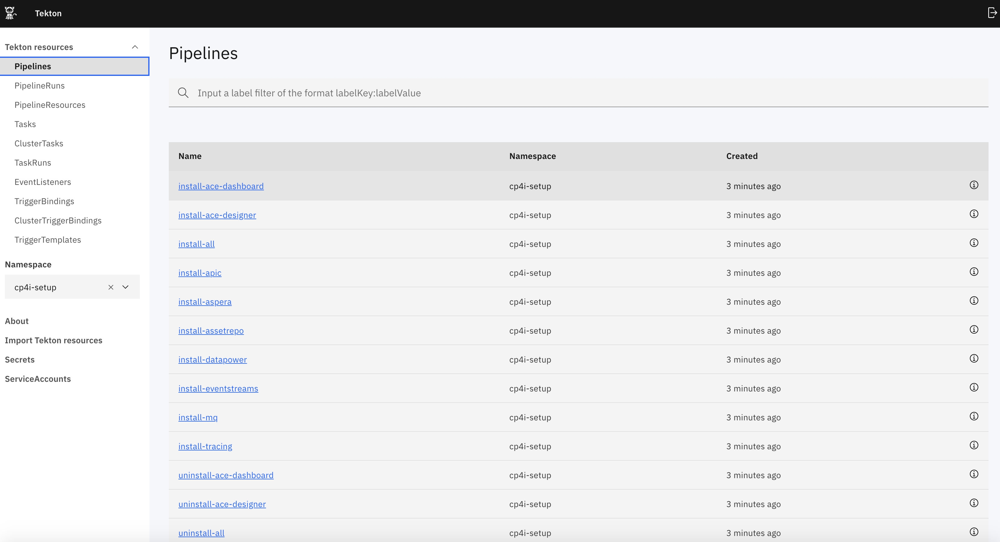
 
<p>&nbsp;</p>
 
#### 2.2 Tekton Pipeline Resources 

The following Tekton Pipeline Resources are created:

* cp4i-setup-source

 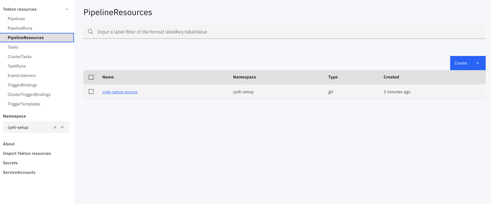

<p>&nbsp;</p>

#### 2.3 Tekton Tasks
 
The following Tekton Tasks are created:

* install-integration-instance
* uninstall-integration-instance

 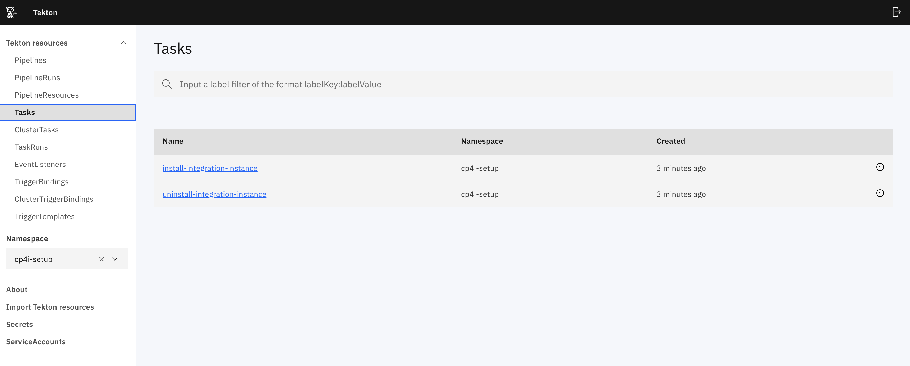
 

<p>&nbsp;</p>
 
### 3. Run Tekton Pipelines

Pipelines can be run to execute the tasks to setup the environment. When the pipelines are run it is required to run using the service account **pipeline**.

#### 3.1 Pipeline for Installing all the integration instances

The parameters for running the pipeline to install all integration instances is listed below:

* **source** - Source having the scripts to perform the setup tasks. It is set to **cp4i-setup-source**
* **production** - Specifies if the deployment is production-like with High Availability enabled. It is set to **false**
* **env**  - Specifies the environment used for running pipeline. The value is used in computing the Helm release name. By default it is set to **dev**
* **ServiceAccount** - Specfies the Service Account to run the pipeline. It is set to **pipeline**

 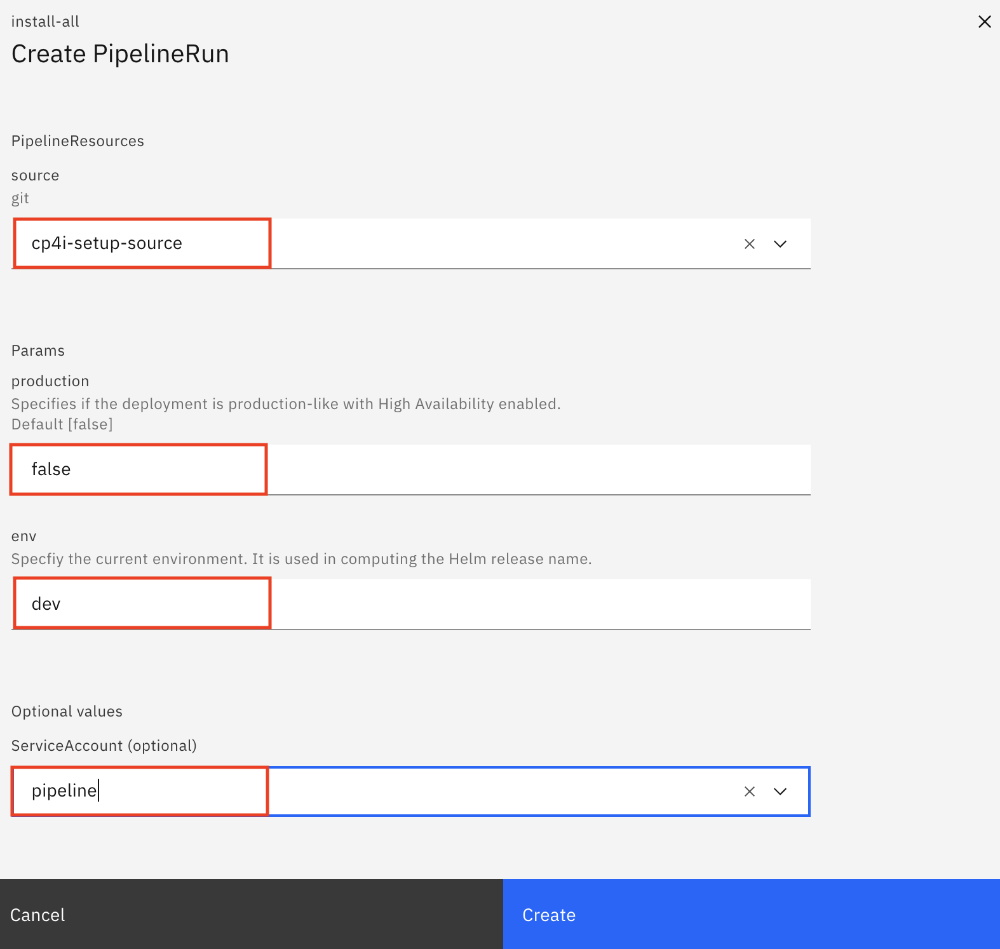

<p>&nbsp;</p>

The pipeline will have the following result after it is completed: 
 
 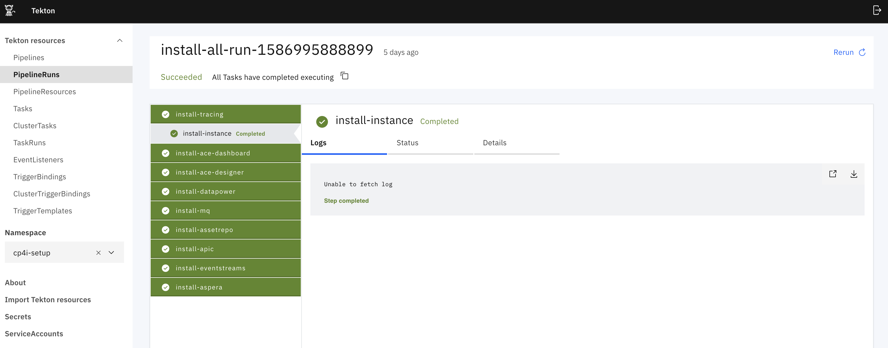

<p>&nbsp;</p>

You will have to accept MQ OIDC registration request after clicking the tracing instance from the CP4I platform navigator as follows:

 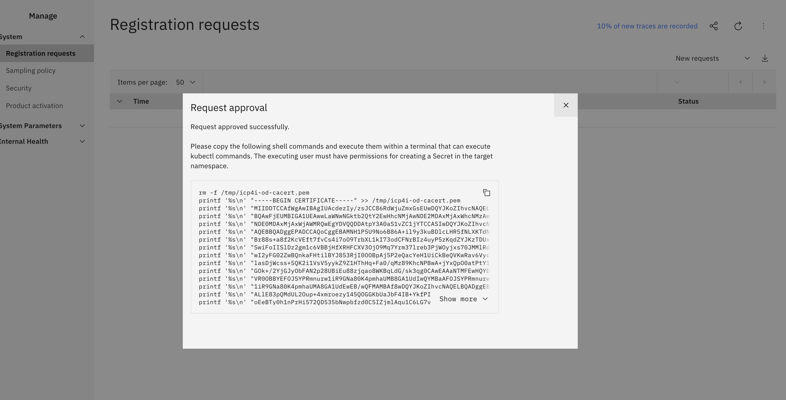

<p>&nbsp;</p>

The commands listed above should be run to create the secrets for the project MQ. Once the secret is created, the MQ instance will be in Running state. 

The following integration instances gets created after this pipeline is run: 
  
 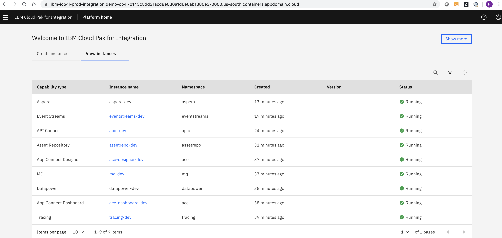

<p>&nbsp;</p>
  
#### 3.2 Pipeline for Install a specific integration instance (MQ, API Connect, Aspera, ACE, DataPower, EventStreams, Tracing, Asset Repository)

The parameters for running the pipeline to install an integration instance is listed below:

* **source** - Source having the scripts to perform the setup tasks. It is set to **cp4i-setup-source**
* **production** - Specifies if the deployment is production-like with High Availability enabled. It is set to **false**
* **env**  - Specifies the environment used for running pipeline. The value is used in computing the Helm release name. By default it is set to **dev**
* **ServiceAccount** - Specfies the Service Account to run the pipeline. It is set to **pipeline**

 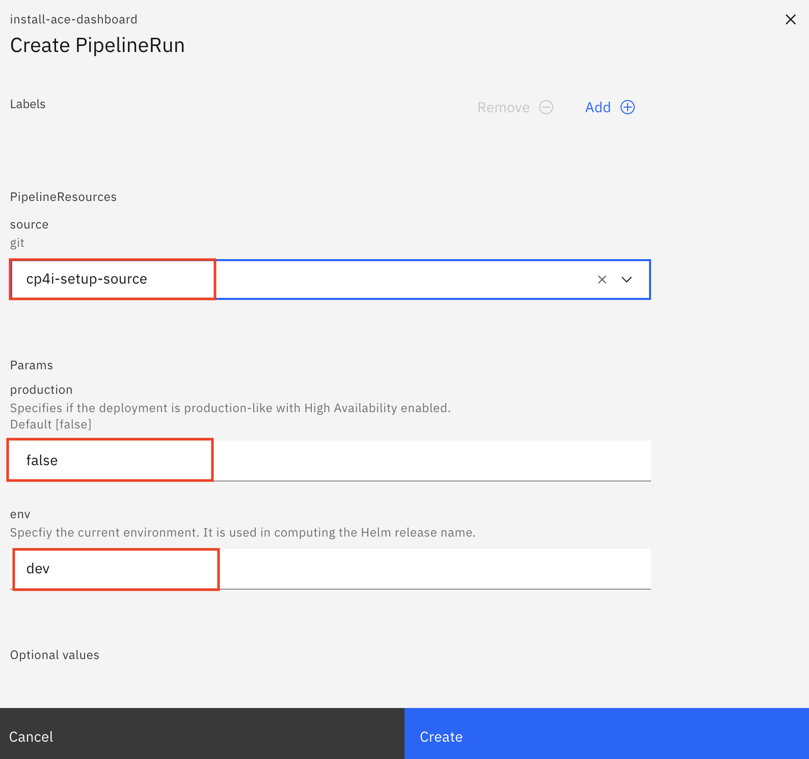

<p>&nbsp;</p>
 
The pipeline will have the following result after it is completed: 
 
 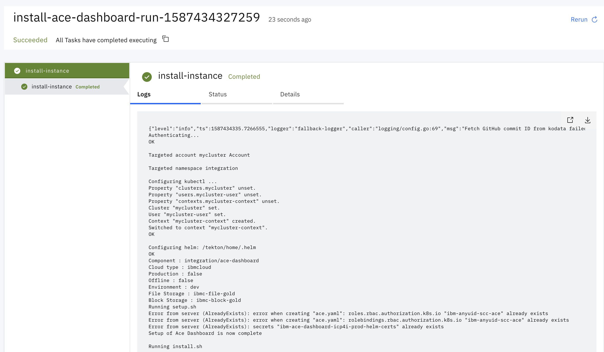


<p>&nbsp;</p>

#### 3.3 Pipeline for Uninstalling ALL the integration instances

The parameters for running the pipeline to uninstall all integration instances is listed below:

* **source** - Source having the scripts to perform the setup tasks. It is set to **cp4i-setup-source**
* **env**  - Specifies the environment used for running pipeline. The value is used in computing the Helm release name. By default it is set to **dev**
* **ServiceAccount** - Specfies the Service Account to run the pipeline. It is set to **pipeline**


 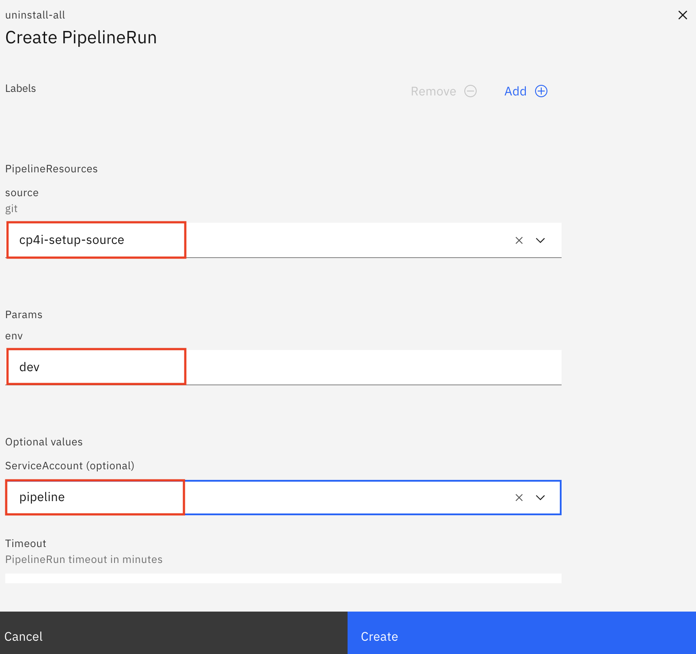

<p>&nbsp;</p>

The pipeline will have the following result after it is completed: 
 
 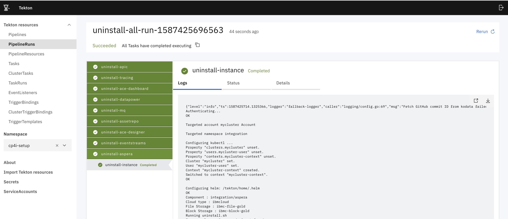

<p>&nbsp;</p>

#### 3.4 Pipeline for Uninstalling a specific integration instance (MQ, API Connect, Aspera, ACE, DataPower, EventStreams, Tracing, Asset Repository)

The parameters for running the pipeline to uninstall an integration instance is listed below:

* **source** - Source having the scripts to perform the setup tasks. It is set to **cp4i-setup-source**
* **env**  - Specifies the environment used for running pipeline. The value is used in computing the Helm release name. By default it is set to **dev**
* **ServiceAccount** - Specfies the Service Account to run the pipeline. It is set to **pipeline**

 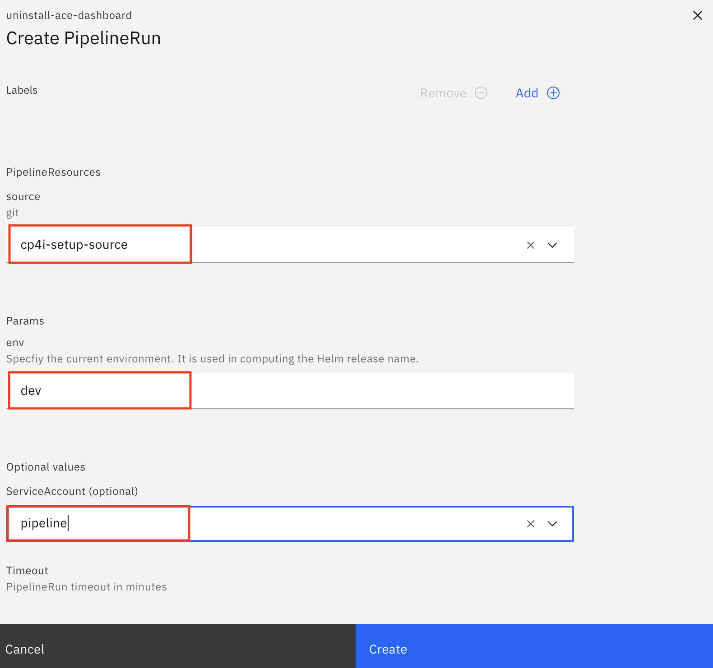
 
<p>&nbsp;</p>
 
The pipeline will have the following result after it is completed: 
 
 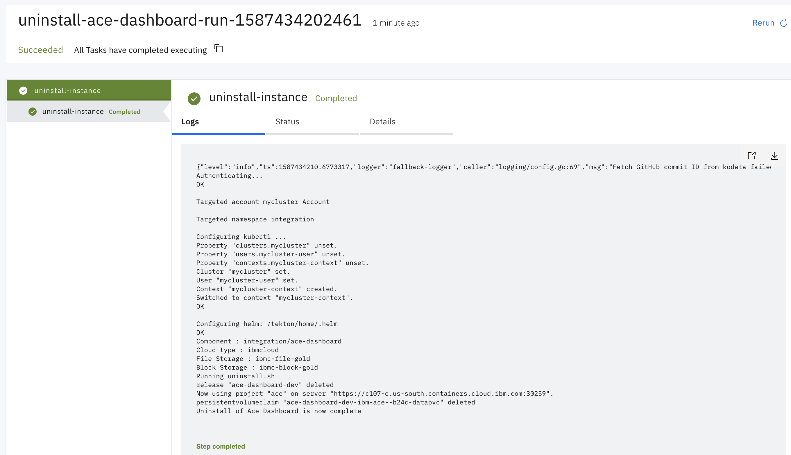
 
